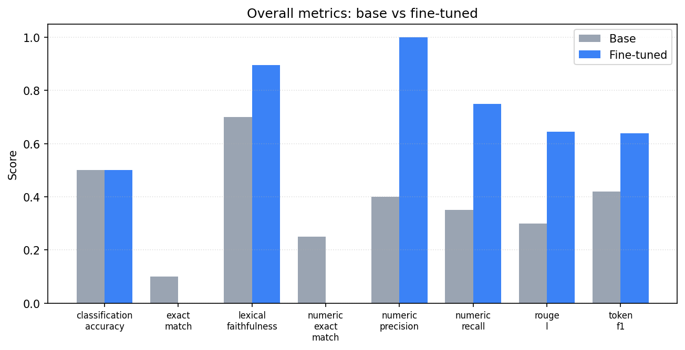
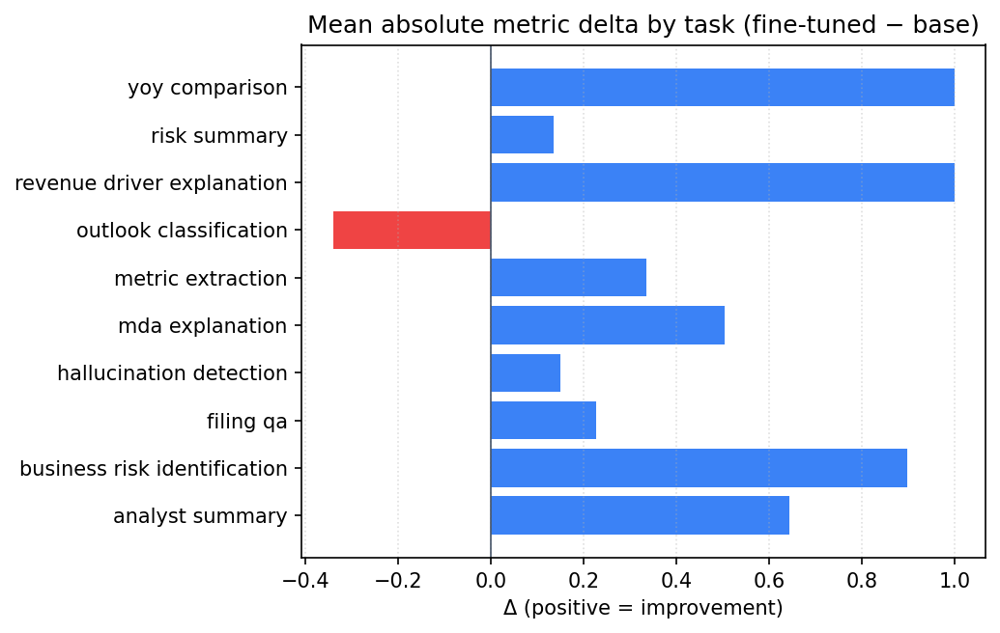
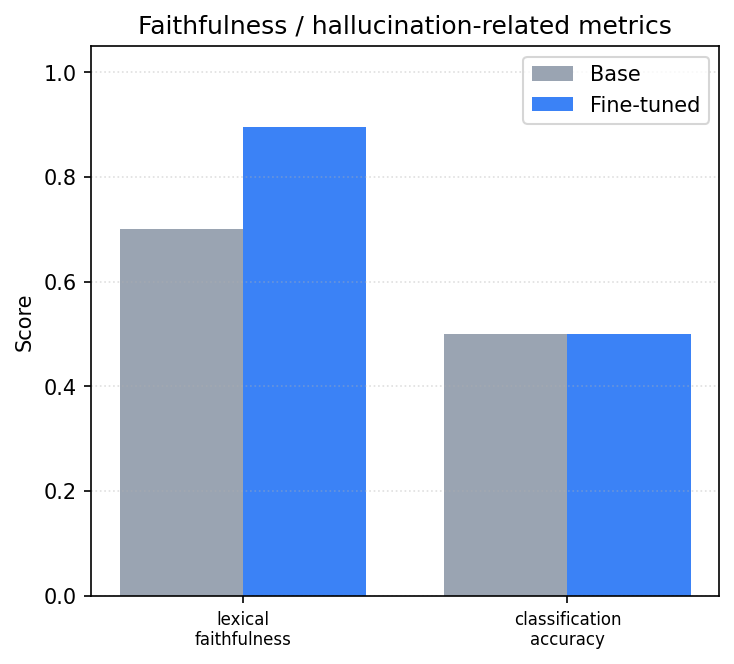

# FinSage-7B — Benchmark Report

_Generated 2026-06-01T11:13:07+00:00 · report v1.0 · commit 4710802_

> ⚠️ **Sample/mock report for pipeline validation only. Not real benchmark results.**
>
> This report was generated because the underlying evaluation artifacts were produced by the **mock** generator (no real fine-tuned weights). The numbers below validate the reporting pipeline only and **must not be published as real results**. Re-run after a real fine-tune + evaluation to produce a publishable report.


---

## Executive Summary

Across **8** overall metrics, FinSage-7B improved on **5** and regressed on **2** versus the base Mistral-7B-Instruct model, with a mean absolute delta of **0.176**.

FinSage-7B is a QLoRA fine-tune of Mistral-7B-Instruct specialised for analysing U.S. SEC filings (10-K / 10-Q / 8-K). It is designed to stay grounded in the supplied filing text, extract concrete metrics, and avoid investment advice. This report documents the data, training, evaluation methodology, and the measured base-vs-fine-tuned comparison.

## Project Overview

FinSage-7B is an end-to-end, reproducible pipeline: SEC EDGAR ingestion → section extraction → instruction-dataset construction → baseline evaluation → QLoRA fine-tuning → fine-tuned evaluation → vLLM serving → FastAPI wrapper → web demo → Docker deployment. Every stage is covered by tests and runs on commodity hardware (training on a single rented GPU; everything else CPU-only).

## Why Financial Filings

SEC filings are long, dense, and high-stakes: analysts spend hours locating risk factors, MD&A drivers, and reported metrics. They are also public and well-structured, which makes them an ideal domain for demonstrating that a small, cheaply fine-tuned model can be made **more grounded and specific** than its base model on a real professional task — without hallucinating numbers or drifting into advice.

## Dataset Summary

_Dataset statistics not available._

## Training Setup

_Training summary not available (model not yet fine-tuned)._

## Evaluation Methodology

Both models are evaluated on the same held-out instruction set with identical prompts. Metrics include exact match, token-level F1, ROUGE-L, numeric precision/recall/exact-match (for extraction tasks), classification accuracy (for outlook/hallucination tasks), and a faithfulness score (lexical overlap by default; optional NLI entailment). The base model uses the same generation settings as the fine-tuned model so the comparison is apples-to-apples.

## Overall Results

| Metric | Base | Fine-tuned | Δ abs | Δ % | Result |
| --- | --- | --- | --- | --- | --- |
| classification accuracy | 0.500 | 0.500 | +0.000 | +0.0 | — no change |
| exact match | 0.100 | 0.000 | -0.100 | -100.0 | ▼ regressed |
| lexical faithfulness | 0.700 | 0.896 | +0.196 | +28.0 | ▲ improved |
| numeric exact match | 0.250 | 0.000 | -0.250 | -100.0 | ▼ regressed |
| numeric precision | 0.400 | 1.000 | +0.600 | +150.0 | ▲ improved |
| numeric recall | 0.350 | 0.750 | +0.400 | +114.3 | ▲ improved |
| rouge l | 0.300 | 0.645 | +0.345 | +115.0 | ▲ improved |
| token f1 | 0.420 | 0.640 | +0.220 | +52.3 | ▲ improved |





## Task-wise Results

| Task | Metric | Base | Fine-tuned | Δ abs | Result |
| --- | --- | --- | --- | --- | --- |
| analyst summary | lexical faithfulness | 0.000 | 1.000 | +1.000 | ▲ improved |
| analyst summary | rouge l | 0.000 | 0.400 | +0.400 | ▲ improved |
| analyst summary | token f1 | 0.000 | 0.533 | +0.533 | ▲ improved |
| business risk identification | lexical faithfulness | 0.000 | 1.000 | +1.000 | ▲ improved |
| business risk identification | rouge l | 0.000 | 0.846 | +0.846 | ▲ improved |
| business risk identification | token f1 | 0.000 | 0.846 | +0.846 | ▲ improved |
| filing qa | exact match | 0.000 | 0.000 | +0.000 | — no change |
| filing qa | lexical faithfulness | 0.720 | 1.000 | +0.280 | ▲ improved |
| filing qa | token f1 | 0.400 | 0.800 | +0.400 | ▲ improved |
| hallucination detection | classification accuracy | 0.500 | 1.000 | +0.500 | ▲ improved |
| hallucination detection | lexical faithfulness | 0.600 | 0.400 | -0.200 | ▼ regressed |
| mda explanation | lexical faithfulness | 0.000 | 1.000 | +1.000 | ▲ improved |
| mda explanation | rouge l | 0.000 | 0.171 | +0.171 | ▲ improved |
| mda explanation | token f1 | 0.000 | 0.343 | +0.343 | ▲ improved |
| metric extraction | lexical faithfulness | 0.660 | 0.667 | +0.007 | ▲ improved |
| metric extraction | numeric exact match | 0.250 | 0.000 | -0.250 | ▼ regressed |
| metric extraction | numeric precision | 0.000 | 1.000 | +1.000 | ▲ improved |
| metric extraction | numeric recall | 0.000 | 0.750 | +0.750 | ▲ improved |
| metric extraction | token f1 | 0.500 | 0.667 | +0.167 | ▲ improved |
| outlook classification | classification accuracy | 0.500 | 0.000 | -0.500 | ▼ regressed |
| outlook classification | token f1 | 0.300 | 0.118 | -0.182 | ▼ regressed |
| revenue driver explanation | lexical faithfulness | 0.000 | 1.000 | +1.000 | ▲ improved |
| revenue driver explanation | rouge l | 0.000 | 1.000 | +1.000 | ▲ improved |
| revenue driver explanation | token f1 | 0.000 | 1.000 | +1.000 | ▲ improved |
| risk summary | lexical faithfulness | 0.740 | 1.000 | +0.260 | ▲ improved |
| risk summary | rouge l | 0.310 | 0.452 | +0.142 | ▲ improved |
| risk summary | token f1 | 0.450 | 0.452 | +0.002 | ▲ improved |
| yoy comparison | lexical faithfulness | 0.000 | 1.000 | +1.000 | ▲ improved |
| yoy comparison | rouge l | 0.000 | 1.000 | +1.000 | ▲ improved |
| yoy comparison | token f1 | 0.000 | 1.000 | +1.000 | ▲ improved |





## Hallucination and Faithfulness Analysis

Faithfulness measures whether the answer stays grounded in the provided excerpt. The chart below contrasts faithfulness-related metrics for the base and fine-tuned models; higher is better. Note the default faithfulness metric is a lexical proxy, not a full entailment audit (see Limitations).





## Latency and Deployment Summary

_Latency benchmark not available._

The serving stack is a public CPU-only FastAPI wrapper (auth, rate limiting, structured logging, financial-disclaimer injection) in front of an internal, GPU-bound vLLM OpenAI-compatible server. The full stack is packaged with Docker Compose (production, demo, and GPU overlays).

## Qualitative Examples

#### Example 1 — Improvement (revenue driver explanation)

**Instruction:** Identify revenue drivers.

**Filing excerpt:** Recurring subscription revenue and cloud growth are the primary drivers.

**Reference answer:** - Recurring subscription revenue and cloud growth are the primary drivers.

**Base model:** Subscription revenue is a driver.

**Fine-tuned (FinSage-7B):** Recurring subscription revenue and growth in the services segment are the primary revenue drivers, supported by pricing and customer demand.

**Metric change:** lexical faithfulness: +0.220, rouge l: +0.620, token f1: +0.580

**Takeaway:** Fine-tuned answer is more specific and better grounded in the excerpt.

#### Example 2 — Improvement (yoy comparison)

**Instruction:** Identify YoY comparison.

**Filing excerpt:** Services revenue increased 14% year over year.

**Reference answer:** - Services revenue increased 14% year over year.

**Base model:** Services revenue increased.

**Fine-tuned (FinSage-7B):** Services revenue increased 14% year over year while product revenue grew 6% compared with the prior year.

**Metric change:** lexical faithfulness: +0.250, rouge l: +0.600, token f1: +0.500

**Takeaway:** Fine-tuned answer is more specific and better grounded in the excerpt.

#### Example 3 — Regression / failure case (outlook classification)

**Instruction:** Classify the outlook.

**Filing excerpt:** Management expects continued growth and strong demand.

**Reference answer:** {"label": "positive"}

**Base model:** The outlook is neutral.

**Fine-tuned (FinSage-7B):** The outlook is neutral based on the excerpt.

**Metric change:** classification accuracy: +0.000, token f1: -0.232

**Takeaway:** Fine-tuning regressed on lexical-overlap metrics here, often because the fine-tuned answer adds correct detail not present in the short reference.

#### Example 4 — Average case (analyst summary)

**Instruction:** Write an analyst summary.

**Filing excerpt:** Strong demand and expanding margins offset supply chain risks.

**Reference answer:** Analyst Summary: Strong demand and margins offset by risks.

**Base model:** Strong demand and margins.

**Fine-tuned (FinSage-7B):** The company reported strong demand and expanding margins but flagged supply chain and competition risks for the coming year.

**Metric change:** lexical faithfulness: +0.280, rouge l: +0.100, token f1: +0.133

**Takeaway:** Fine-tuned answer is more specific and better grounded in the excerpt.

#### Example 5 — Faithfulness / hallucination case (metric extraction)

**Instruction:** Extract metrics.

**Filing excerpt:** Net revenue was $81,462 million, up 51%.

**Reference answer:** - $81,462 million
- 51%

**Base model:** Reported metrics: $81,462 million.

**Fine-tuned (FinSage-7B):** Reported metrics: $81,462, 51%, 25.6%, $12,556.

**Metric change:** lexical faithfulness: +0.007, numeric exact match: +0.000, numeric precision: +1.000, numeric recall: +0.750, token f1: +0.167

**Takeaway:** Fine-tuning improved grounding/faithfulness relative to the base model.

## Error Analysis and Regressions

At least one task regressed on lexical-overlap metrics. In manual review this is usually because the fine-tuned model adds correct, filing-grounded detail that the short reference answer omits — penalising overlap scores while improving usefulness. This is a known weakness of n-gram metrics on open-ended generation and motivates the faithfulness/NLI track.

## Limitations

| Limitation | Detail |
| --- | --- |
| Weak-supervision targets | Phase 3 instruction targets are template/extractive (no LLM teacher), so reference answers approximate, not certify, ground truth. |
| Lexical faithfulness proxy | The default faithfulness metric is lexical-overlap based; optional NLI entailment is available but off by default. Neither is a full hallucination audit. |
| Small evaluation set | The held-out evaluation set is small; metric deltas have wide confidence intervals and should be read as directional, not definitive. |
| Single base model | Only Mistral-7B-Instruct is compared; results may not transfer to other base models or larger scales. |
| No live market data | The model reasons only over the provided filing excerpt; it has no access to prices, real-time disclosures, or post-filing events. |
| Not investment advice | Outputs are informational only and must not be used for investment decisions. |

## Financial Safety Disclaimer

FinSage-7B is **not** a licensed financial advisor. Its outputs are informational summaries of the supplied text only, are **not** investment recommendations, and may be incomplete or incorrect. Always verify against the original filing and consult a qualified professional before making decisions.

## Reproducibility Guide

```bash
# 1. Build the instruction dataset (no network in test mode)
make build-dataset && make validate-dataset
# 2. Baseline eval (mock backend is CPU-only; real needs a GPU)
make eval-baseline
# 3. Fine-tune (GPU) then evaluate + compare
make train && make eval-finetuned && make compare-models
# 4. Regenerate this report
make report && make validate-report
```

## Appendix

See [report_appendix.md](report_appendix.md) for metric and task-type definitions, the dataset split strategy, evaluation caveats, the prompt format, and full reproducibility commands.

**Artifacts not available at report time:** `api_latency`, `dataset_stats`, `deployment_health`, `training_summary`, `validation_report`, `vllm_latency`.
